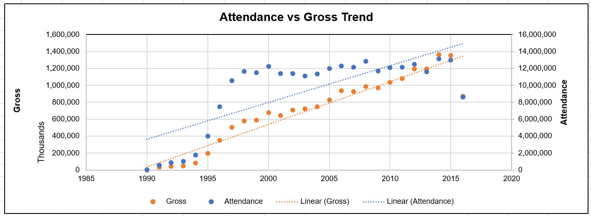

#  L.Wood_Final_Capstone_Project

Captone Project Report - Factors for Success on Broadway

Author: Loni J Woood
Date:  3/18/2023

## Project Overview

The purpose of this project was to discover what factors make a successful show on Broadway.  In order to determine success, the goal was use machine learning models to predict gross.  

## Project Plan Steps

1.  Create GitHub Respository
2.  Define Domain and Question
3.  Data Collection  
4.  Data Review and Cleaning
5.  Exploratory Data Analysis
6.  Machine Learning
7.  Analyze Findings

## Dataset

The dataset for this project can be found at: https://corgis-edu.github.io/corgis/csv/broadway/

The dataset was originally gathered by the Broadway League.  https://www.broadwayleague.com/home/

## Report

The overleaf report can be found at: https://www.overleaf.com/read/qwjkgksxjndz

All screenshots and images used in the report can be found at: https://github.com/lwood7983/L.Wood_Final_Capstone_Project/tree/main/images

Additional resources cited in the report can be found at:

- https://www.broadwayworld.com/article/A-Brief-History-of-Broadway-20211219
- https://www.nytimes.com/2021/09/13/theater/broadway-reopening.html
- https://www.city-journal.org/html/unexpected-lessons-times-square\%E2\%80\%99s-comeback-12235.html
- https://www.introducingnewyork.com/broadway#:~:text=Broadway\%20is\%20a\%20boulevard\%20full,Manhattan\%20at\%20an\%20oblique\%20angle.
- https://www.forbes.com/sites/rogersands/2023/01/20/broadway-the-engine-that-helps-fuel-new-york-citys-economy/?sh=6bd122bc53cc
- https://www.minneapolisfed.org/about-us/monetary-policy/inflation-calculator/consumer-price-index-1913-
- https://www.bls.gov/cpi/",
- https://www.broadwayleague.com/research/statistics-broadway-nyc/

## Before you begin
This project used both Excel and Python via a Juypter Notebook  for the analysis.  Before you start, be sure you have the following installed.

- Python: https://www.python.org/downloads/
- pandas: https://pandas.pydata.org/docs/getting_started/install.html
- numpy : https://www.youtube.com/watch?v=Z7L72qqFtn8
- matplotlib.pyplot: https://matplotlib.org/stable/users/installing/index.html
- seaborn: https://seaborn.pydata.org/installing.html
- scipy: https://scipy.org/install/
- scikit-learn: https://scikit-learn.org/stable/install.html
- jupyterlab:  https://jupyter.org/install
- Excel:  https://www.microsoft.com/en-us/microsoft-365/excel

## File Descriptions

- L_Wood__Capstone_Project_Report.pdf:  This is the pdf version of the project report.  The overleaf report can be found at: https://www.overleaf.com/read/qwjkgksxjndz
- original_broadway.csv:  The original dataset for the project in csv format.  The file can be found at:  https://corgis-edu.github.io/corgis/csv/broadway/
- broadway_clean.xlxs:  The excel file used for data cleaning.  This file also contains some visualizations.
- broadway_clean_inflation.xlxs:  The excel file used to perform additional analysis to understand what impact, if any, inflation had on gross.
- Capstone_results.xlxs:  The excel file where the results from the regression models were stored.  The file also contains some visualizations.
- Capstone_lwood.ipynb:  The jupyter notebook used to perform Python coding.  The coding included data cleaning, machine learning, and visualizations.  Link to the notebook is at: https://github.com/lwood7983/L.Wood_Final_Capstone_Project/blob/84b81d88ab61b1bd3d8d0c3b8600500038c1639d/Capstone_lwood.ipynb
- images:  This folder contains all of the images and screeenshots used in the report. Link to the images folder is at: https://github.com/lwood7983/L.Wood_Final_Capstone_Project/tree/main/images

## Project Results

Linear regression, multiple regression, polynomial with degree 2, polynomial with degree 3, elastic net regression with degrees 3 and 8 were used to predict gross.  Each of the models were ran with and without attendance as an independent variable.  The reason was due to attendance being an unknown factor in advance.  Overall the polynomial with degree 2, or quadratic polynomial, performed the best in predicting gross in either scenario. Multiple regression performed the worst and had the highest RMSE and R^2 scores in both scenarios.  While polynomial regression with degree 3, or cubic polynomial, performed relatively the same as the quadratic polynomial,  there was slight overfitting.  Overfitting can cause problems when using new data sets since the model begins to lose its ability to generalize.

A deeper analysis was done to identify what was impacting the increase in gross over the years.  Two possible impacts were investigated: inflation and attendance.  The first possible impact was around inflation.  The consumer price index was used to calculated the adjusted inflated average ticket price vs the average ticket price per year.  When inflation was removed, there was a minimal upward trend in ticket price when compared to the average ticket price. 

The second possible impact was attendance.  A scatter plot comparing gross and attendance revealed that both have an upward trend with a big growth around 2016-2017.  The jump could be a related to the cleanup discussed in the article at https://www.city-journal.org/html/unexpected-lessons-times-square\%E2\%80\%99s-comeback-12235.html.  The scatter plot also showed that even with attendance declining the gross still was increasing.  What was discovered with these gross impact factors is that inflation is a key part in the increaseing gross, but attendance, which is a non-inflation factor, also has an impact.

## Future Work Ideas
Some future work ideas are:

- Understand what impact reviews have on the success of a show.  This could be done using sentiment analysis from social media or newpapers.
- Understand what impact Covid had on the independent variables and how it impacted the gross.
- Understand if Tony Awards have any impact on the success of a show or if a successful show wins a Tony Award.
- Understand if the lead performers in a show impact its success.

## Resources

Below are links to some tutorials that were used to assist in building this report.

- https://www.youtube.com/watch?v=4yI3vVe0Jos
- https://www.youtube.com/watch?v=fhi4dOhmW-g
- https://www.youtube.com/watch?v=-o3AxdVcUtQ
- https://www.youtube.com/watch?v=gN1nQT-lA_k
- https://www.youtube.com/watch?v=BOk1hlCPW0c
